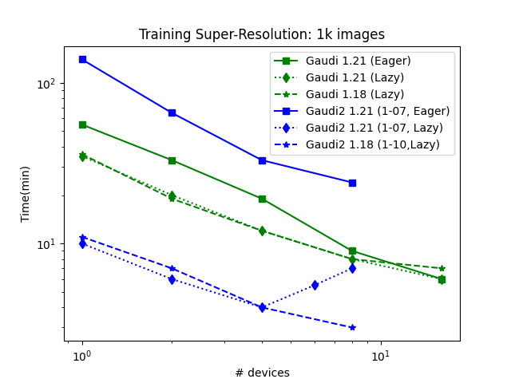

# Profiling of the SR3 model on the Voyager HPC system
Since most of this project is running on Voyager, we performed a set of SR3 runs on it to check its performance agains different Intel Gaudi cards and Synapse AI versions.

Every run had to perform the same task: 1000 steps (images) in the main training loop (no validation, no inference).

In this subfolder we store the yaml files to reproduce such runs in Kubernets in Voyager as well as the configuration files with the (hyper-)parameters.

## Results

In general, the SR3 model shows great scaling thanks to my implementation of Pytorch's DDP.

In the above (logscale) plot, the results from the Gaudi1 and Gaudi2 cards are shown in green and blue respectively. Square solid lines indicate 1.21 Eager mode, diamond dotted lines for 1.21 Lazy mode and star dashed lines for 1.18 Lazy mode.

Some conclusions from this plot:
- Eager mode leads to much slower runs than Lazy.
- Gaudi2 cards exhibit roughly 3x speed-up compared to first generation Gaudi card.
- Performance worse for 6+ cards on the Gaudi2 node with 1.21 in Lazy mode. Needs extra analysis.

**NOTE**: Intel Habana changed the default mode to run Pytorch from Lazy (in 1.18) to Eager (1.21). After discussion with the Habana team, they recommend running Diffusion models in Lazy mode (`PT_HPU_LAZY_MODE=1`) with a small `PT_HPU_MAX_COMPOUND_OP_SIZE` (`=2` in these runs). Future Synapse AI releases may drop Lazy mode support so Eager + `torch.compile` will be needed.
